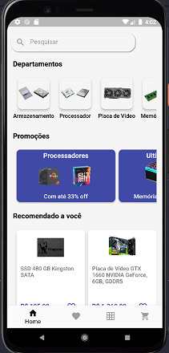
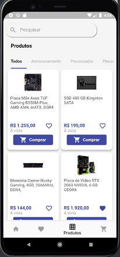

# e_commercex

Um projeto de estudos de um pequeno ecommerce para por em prática conhecimentos de flutter e dart com a utilização do serviço  de banco de dados Nosql firestore da plataforma firebase.

## Telas da Aplicação

- tela 1: Home page
- tela 2: Lista de produtos favoritos
- tela 3: Página dos produtos
- tela 4: Carrinho de compras

## Packages
Foi utilizado no projeto os seguintes packages.
- [Firebase Core](https://pub.dev/packages/firebase_core)
- [Cloud Firestore](https://pub.dev/packages/cloud_firestore)
- [Intl](https://pub.dev/packages/intl)
